# Entity Relationship Diagram (ERD)

## Overview

The Integration Catalog Database is designed around a central entity:

```text
integration
```

The model supports:

- Integration ownership
- Integration classification
- Geographic coverage
- Product compatibility
- Technical architecture
- Functional capabilities
- Integration features
- Business flows
- Integration dependencies
- Documentation management
- Contact management

Version:

v3.0.0

---

# ERD

```mermaid
erDiagram

    integration_type ||--o{ integration : classifies
    partner ||--o{ integration : owns
    integration_status ||--o{ integration : governs

    partner ||--o{ contact : has
    contact_role ||--o{ contact : classifies

    integration ||--o{ documentation : has
    documentation_type ||--o{ documentation : classifies

    integration ||--o{ integration_capability : supports
    capability ||--o{ integration_capability : defines

    integration ||--o{ integration_country : available_in
    country ||--o{ integration_country : contains

    integration ||--o{ integration_product : compatible_with
    anchanto_product ||--o{ integration_product : uses

    integration ||--o{ integration_method_mapping : supports
    integration_method ||--o{ integration_method_mapping : defines

    integration ||--o{ integration_endpoint : exposes
    endpoint_type ||--o{ integration_endpoint : classifies
    authentication_method ||--o{ integration_endpoint : secures

    integration_endpoint ||--o{ integration_endpoint_environment : deployed_in
    endpoint_environment ||--o{ integration_endpoint_environment : defines

    integration ||--o{ integration_status_history : tracks
    integration_status ||--o{ integration_status_history : records

    integration ||--o{ integration_feature_mapping : supports
    integration_feature ||--o{ integration_feature_mapping : defines

    integration ||--o{ integration_flow_mapping : participates_in
    integration_flow ||--o{ integration_flow_mapping : contains

    integration_flow ||--o{ integration_flow_step : contains
    integration ||--o{ integration_flow_step : participates

    integration ||--o{ integration_dependency : source
    integration ||--o{ integration_dependency : target
```



---

# Architecture Layers

## Core Business Layer

```text
partner
integration
contact
documentation
```

---

## Reference Layer

```text
integration_type
country
integration_method
integration_status
documentation_type
contact_role
authentication_method
endpoint_type
endpoint_environment
```

---

## Capability Layer

Question Answered:

```text
What does the integration do?
```

Entities:

```text
capability
integration_capability
```

---

## Feature Layer

Question Answered:

```text
What specialized functionality exists?
```

Entities:

```text
integration_feature
integration_feature_mapping
```

---

## Flow Layer

Question Answered:

```text
How does information move?
```

Entities:

```text
integration_flow
integration_flow_mapping
integration_flow_step
```

---

## Dependency Layer

Question Answered:

```text
What depends on what?
```

Entities:

```text
integration_dependency
```

---

## Technical Architecture Layer

Entities:

```text
integration_endpoint
integration_endpoint_environment

endpoint_type
authentication_method
endpoint_environment
```

---

## Governance Layer

Entities:

```text
integration_status
integration_status_history

documentation_type

contact_role
```

---

# Relationship Summary

| Parent           | Child                      | Type |
| ---------------- | -------------------------- | ---- |
| integration_type | integration                | 1:N  |
| partner          | integration                | 1:N  |
| partner          | contact                    | 1:N  |
| integration      | documentation              | 1:N  |
| integration      | capability                 | N:N  |
| integration      | country                    | N:N  |
| integration      | anchanto_product           | N:N  |
| integration      | integration_method         | N:N  |
| integration      | integration_feature        | N:N  |
| integration      | integration_flow           | N:N  |
| integration_flow | integration_flow_step      | 1:N  |
| integration      | integration_endpoint       | 1:N  |
| integration      | integration_status_history | 1:N  |

---

# Design Principles

- Documentation First
- Reference Data Strategy
- Normalized Relational Model
- Explicit Foreign Keys
- Separate Business and Technical Concerns
- Reusable Functional Concepts
- Universal Integration Model
- PostgreSQL Optimized Design

---

# Architectural Questions Supported

Capability

```text
What does the integration do?
```

---

Feature

```text
What specialized functionality exists?
```

---

Flow

```text
How does information move?
```

---

Dependency

```text
What depends on what?
```

---

# Outcome

The Integration Catalog Database provides a unified repository for:

- Integration Discovery
- Technical Architecture
- Functional Architecture
- Flow Modeling
- Dependency Analysis
- Governance
- Documentation

The model is considered ready for v3.0.0 release.
