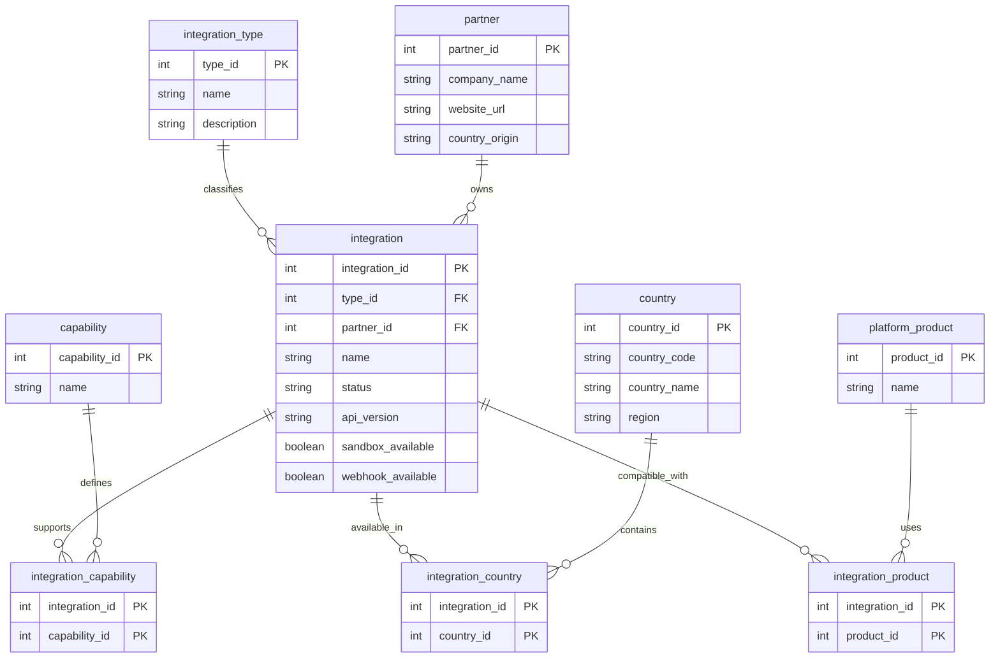

# Entity Relationship Diagram (ERD)

## Overview

The Integration Catalog Database is designed around a central entity: `integration`.

The model supports:

- Integration ownership
- Integration classification
- Geographic coverage
- Functional capabilities
- Product compatibility

---

# ERD



---

# Relationship Summary

| Parent           | Child            | Type |
| ---------------- | ---------------- | ---- |
| integration_type | integration      | 1:N  |
| partner          | integration      | 1:N  |
| integration      | capability       | N:N  |
| integration      | country          | N:N  |
| integration      | platform_product | N:N  |

---

# Current Scope

## Core Tables

- integration
- partner
- integration_type

## Reference Tables

- capability
- country
- platform_product

## Junction Tables

- integration_capability
- integration_country
- integration_product

---

# Design Principles

- Normalized relational model
- Surrogate integer keys
- Explicit foreign keys
- No duplicated business data
- Many-to-many relationships handled through junction tables
- PostgreSQL optimized approach

---

# Future Extensions

Planned entities:

- contact
- documentation
- connection_type
- api_version_catalog
- integration_status_history

```

```
