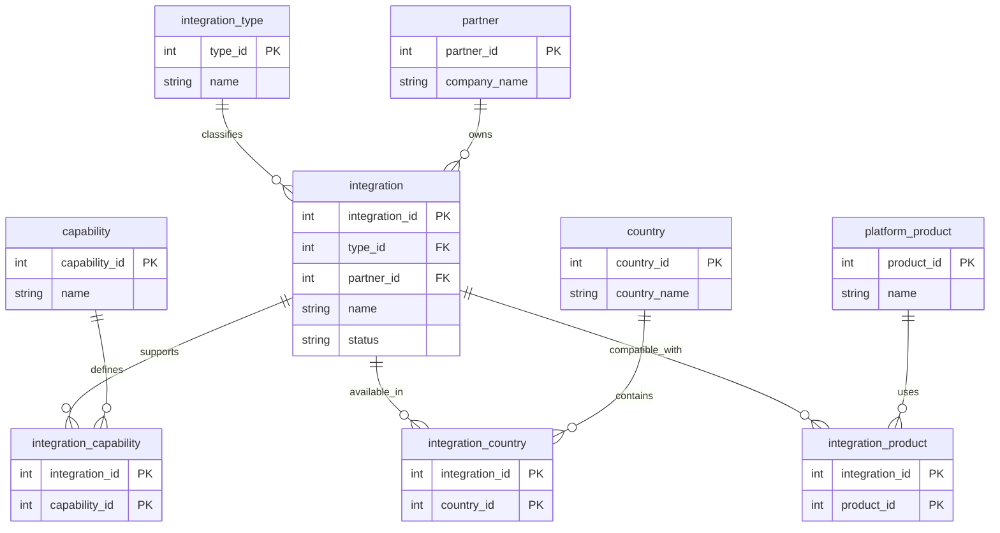

# Entity Relationship Diagram

## ERD

## Current Scope

Current entities:

- integration
- partner
- integration_type
- capability
- country
- platform_product

Current junction tables:

- integration_capability
- integration_country
- integration_product
